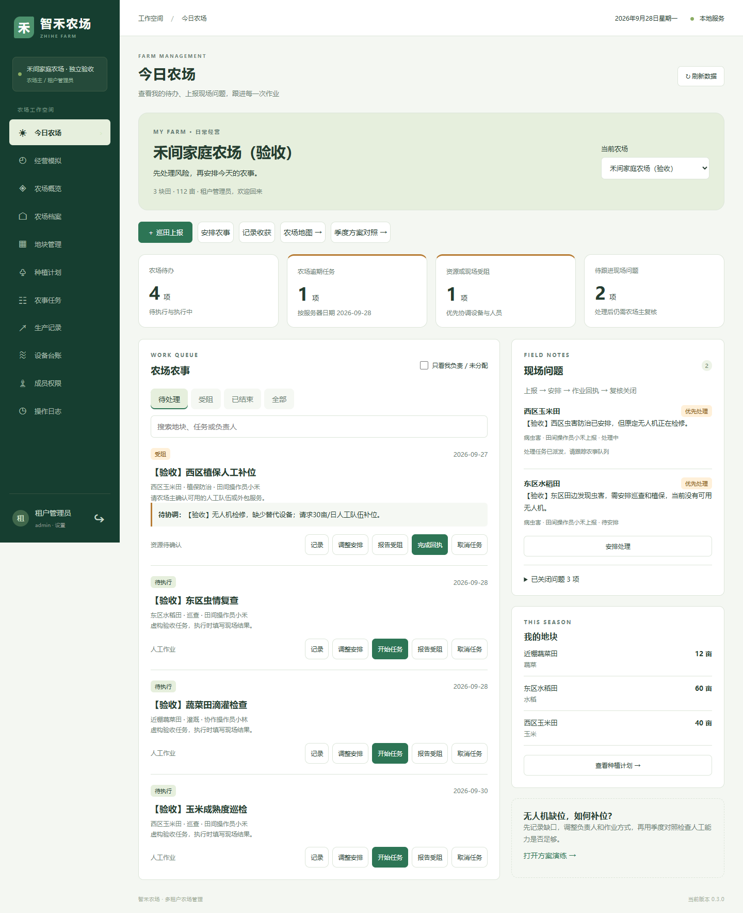
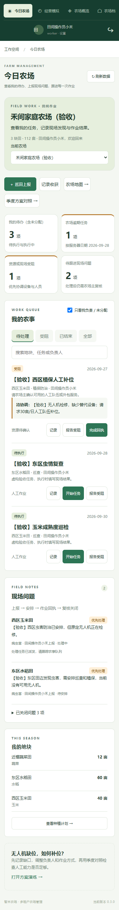
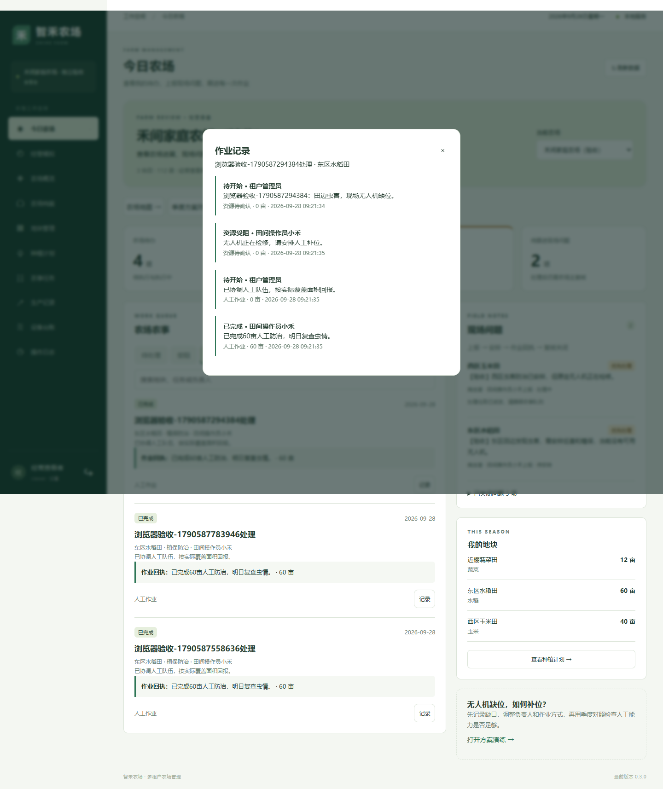
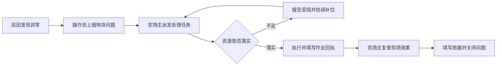
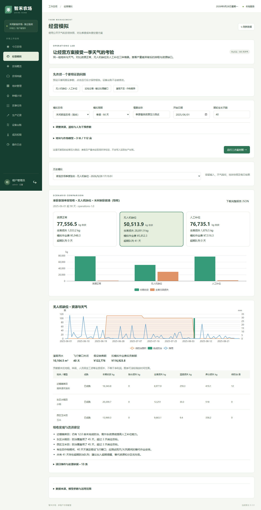
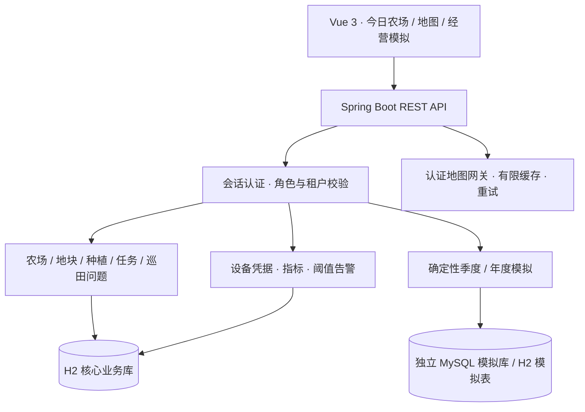

<p align="center"></p>

<p align="center">
  
  
  
  
</p>

智禾农场是一个面向多租户的农场经营工作空间，也照顾只经营一座农场的个人用户。它把地块、种植、农事、设备和收获连接起来，让“今天先做什么”“哪里缺人缺设备”“这次作业做了多少”有据可查。

**[快速启动](#快速启动) · [角色与验收](#角色与验收) · [季度场景](#用一季度检验经营方案) · [文档](#继续了解)**

## 🌾 登录后，先看今天的农场



- **农场主**：先处理逾期、资源缺口和现场问题，再安排负责人、日期与作业方式。
- **操作员**：默认进入自己的任务队列，田间上报、报告受阻、填写完成回执。
- **查看者**：查看经营进展和处理记录，不提供业务写入操作。
- **单农场用户**：自动选中唯一农场，进入种植、收获、地图或模拟时保持当前农场。

<details>
<summary>📱 看看手机端与作业回执</summary>

<p></p>



手机端保留文字导航和触控按钮。任务不再只靠一个“完成”状态：作业方式、面积、结果、执行人和时间都被记录。

</details>

## 从发现问题，到确认解决



完成作业后，现场问题仍等待农场主复核。取消未完成的处理任务会让问题回到“待安排”，便于重新派发。服务端校验租户、执行角色与负责人，旧状态接口不能绕过新任务的回执要求。

## 🗺️ 地图、设备与经营数据

| 能力 | 当前实现 |
|---|---|
| 地块与种植 | 农场筛选、地块面积、种植周期、重叠检查、状态流转 |
| 实景地图 | 卫星影像 / 街道地图 / 离线布局，地块边界与设备点位，加载失败可重试 |
| 设备接入 | 人工录入、本地模拟、带设备凭据的 HTTP 上报，多指标和阈值告警 |
| 单农场设备控制 | 气象/墒情/水情/虫情模板、闸门和泵房模拟控制、HTTP 指令领取与回执、操作记录 |
| 数据看板 | 作物构成、任务状态、产量趋势、环境监测曲线 |
| 账号设置 | 昵称、头像、密码、深浅主题、主题色，管理员重置成员临时密码 |
| 数据隔离 | 租户由认证会话确定；平台管理员不读取租户经营数据 |

地图底图具有拍摄时间差，卫星影像不是实时视频。地块叠加位置需要校准；示例农场、设备与经营数据均为虚构。

## 用一季度检验经营方案

假设你经营 **60 亩水稻、40 亩玉米、12 亩蔬菜**，虫害发生时无人机检修 45 天。安排人工补位是否有效？巡检太慢又会怎样？



| 模拟输入 | 资源正常 | 无人机缺位 | 人工补位 |
|---|---:|---:|---:|
| 常规巡检、灌溉 | 77,556 kg | 50,514 kg | 76,735 kg |
| 巡检间隔延长为 14 天 | 70,766 kg | 50,514 kg | 70,542 kg |
| 灌溉能力降至 30 m³/日 | 62,010 kg | 40,838 kg | 61,416 kg |

表中为本机 90 天模型模拟收获量，按整数显示。天气回放来自公开再分析数据；作物参数、资源能力和成本有明确假设，**未经现场农学标定，不是产量承诺或生产处方**。报告保留每日事件、地块快照、天气指纹与参数，可查看缺水、虫害等归因。结果保存在独立模拟数据库，不写入实际产量台账。

完整参数、结果和验收步骤见 [单农场场景与验收指南](docs/单农场场景与验收指南.md)。

## 快速启动

准备 **JDK 21+、Maven 3.9、Node.js 22.12+**。

```powershell
git clone https://github.com/Waker-visual/zhinong-platform.git
Set-Location zhinong-platform
powershell.exe -NoProfile -ExecutionPolicy Bypass -File .\scripts\start-demo.ps1
```

首次运行安装依赖、构建并启动。浏览器访问 **http://127.0.0.1:9175**。以后代码没有变化时可以跳过构建：

```powershell
.\scripts\start-demo.ps1 -SkipBuild
```

脚本在本机第一次初始化时生成随机密码并保存到 `.cache/demo-password.txt`；重启不会覆盖已有账户密码。初始演示租户为 `demo-a` / `demo-b`，成员为 `admin` / `operator` / `viewer`；平台账号为租户 `platform`、用户名 `platform`。保持终端运行，按 `Ctrl+C` 停止。

### 可选：独立 MySQL 经营模拟库

核心业务默认使用 H2 文件数据库。未配置 MySQL 时，模拟模块使用同一个 H2 数据库中的独立模拟表；本次季度验收使用了独立 MySQL 数据库。

```powershell
# 将路径替换为本机 MySQL 安装目录；脚本使用独立数据目录和 3317 端口
.\scripts\setup-simulation-db.ps1 -MySqlHome 'C:\tools\mysql'
.\scripts\start-demo.ps1 -SkipBuild
```

也可按 [账号地图与经营模拟指南](docs/账号地图与经营模拟指南.md) 配置本机模拟库连接。当前仅接受 localhost / 127.0.0.1 的 MySQL 地址。

### 开发与验证

```powershell
# 后端服务保持运行；另开终端启动前端开发服务器
Set-Location frontend
npm.cmd ci
npm.cmd run dev
# http://127.0.0.1:4273
```

项目根目录运行 `scripts/verify.ps1`，执行后端测试、前端构建、项目检查工具测试及敏感信息扫描。仓库提供 `docs/ci/verify.example.yml` 作为 GitHub Actions 配置示例；本次公开快照未启用自动运行，也可在本机运行上述验证脚本。

## 角色与验收

启动服务后，在项目根目录执行：

```powershell
node tools/prepare_farm_acceptance.cjs
Get-Content .cache/farm-acceptance-accounts.md
node tools/test_individual_farm.cjs
```

准备脚本仅允许访问本机，创建 `family-trial` 和 `neighbor-trial` 独立验收租户。它沿用平台账号，新增账号各自使用随机密码；若平台账号已改密，可通过当前终端的 `FARM_PLATFORM_PASSWORD` 提供新密码。浏览器验收需要本机 Microsoft Edge，会产生明确标注的验收业务记录。

| 身份 | 主要可操作内容 | 限制 |
|---|---|---|
| 平台管理员 | 创建、启停租户 | 不访问租户经营数据 |
| 农场主 / 租户管理员 | 农场资料、派发、复核、成员管理 | 仅本租户 |
| 操作员 | 上报、自己负责的任务、产量和监测记录 | 不能修改其他操作员已分配的任务 |
| 查看者 | 查看农场、任务、记录和模拟历史 | 不写入业务数据 |

同租户成员的查看权限仍以整个租户为范围，任务负责人限制属于执行权限，不是地块级数据保密权限。

## 🧩 架构



```text
backend/       业务 API、鉴权、作业闭环、设备接入与模拟
frontend/      Vue 页面、Leaflet 地图、ECharts 图表与主题
scripts/       Windows 启动、数据库准备与验证
tools/         本机验收、截图与项目检查
docs/          架构、操作说明、验收场景与展示截图
```

## 继续了解

- [单农场场景与验收指南](docs/单农场场景与验收指南.md)
- [账号、地图与经营模拟](docs/账号地图与经营模拟指南.md)
- [设备接入接口](docs/设备接入接口.md)
- [设备校准、控制与回退验收](docs/设备校准与控制验收.md)
- [架构与改造说明](docs/架构与改造说明.md)
- [依赖与权属说明](docs/依赖与权属说明.md)

交互组织参考 [Farmbrite 任务管理](https://help.farmbrite.com/help/tasks-tasks) 的待办与负责人视角，以及 [AGRIVI Field Operations](https://www2.agrivi.com/blog/agrivi-presents-field-operations-new-way-seamlessly-manage-your-farm-operations) 的地块中心视角。界面与业务实现为本项目代码，未复制这些产品的图片或源码。

## 公开范围与权属

本仓库公开源码、说明与虚构验收场景截图，未选择新的开源许可证。第三方依赖、地图和天气数据遵循各自许可及署名要求。公开展示不改变原项目授权、合作开发或委托开发等权利关系；具体权属仍以实际协议与证明为准。

账号密码、运行数据库、会话、设备密钥、地图缓存和内部资料均不在公开版本中。

当前版本适用于本机演示和流程验证。新增“青禾设备联动演示场”使用构造的设备、坐标和数据，支持闸门/泵房模拟控制以及通用 HTTP 指令领取与回执；尚未连接甲方服务器、实体设备、视频或厂商控制服务。公网生产部署需要另行完成依赖升级、HTTPS、备份恢复和容量验证。升级前请备份数据库，回退旧版程序时配套恢复旧数据库，详见控制验收指南。
