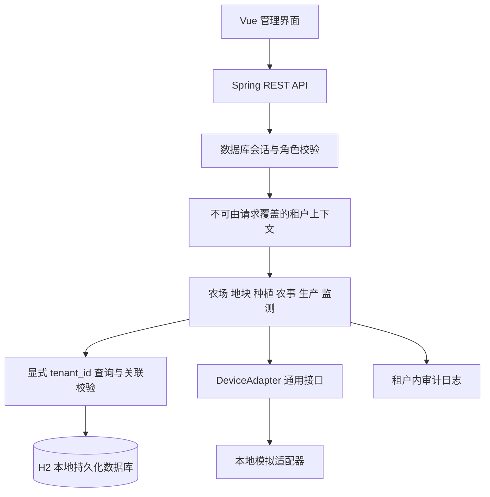
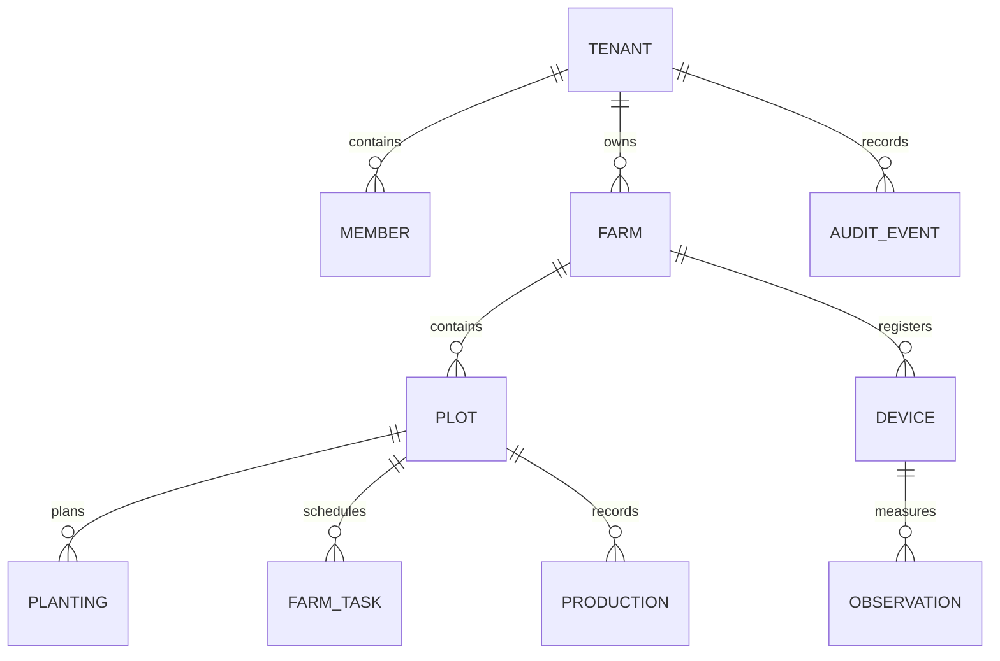
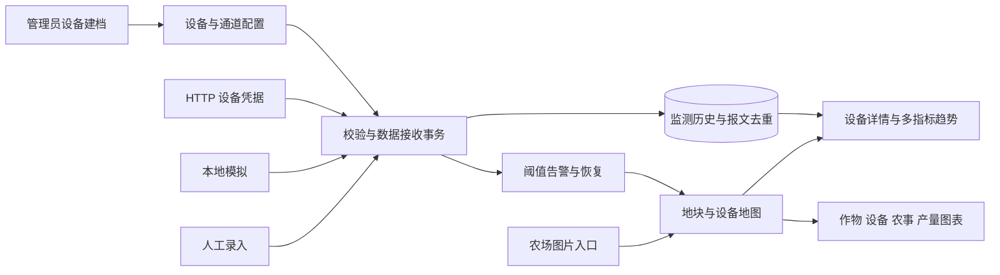

# 智禾农场架构说明

智禾农场采用 Vue 前端和 Spring Boot 后端，按账号、农场业务、设备、地图和经营模拟划分模块。

## 分层结构

采用模块化单体便于本机运行与流程验证。保留 Java/Vue 技术方向；持久层用显式参数化 SQL，使每项租户条件可审查。H2 是本次实际验证的数据库；生产改用其他数据库时需要迁移脚本和兼容性测试，不能仅改连接串就声称支持。

## 数据关系

业务 ID 使用 UUID；UUID 只降低枚举便利性，授权仍依靠 tenant_id。关联表采用 (tenant_id, parent_id) 复合外键；查询和写入同时校验当前租户。会话保存随机令牌的 SHA-256，口令使用 BCrypt，不存明文。

## 权限

| 角色 | 可读范围 | 可写范围 |
|---|---|---|
| 平台管理员 | 租户基本状态 | 创建/停用租户；不能读取租户经营数据 |
| 租户管理员 | 所属租户全部业务、成员、日志 | 业务增改、成员管理 |
| 操作员 | 所属租户业务 | 农事状态、产量和监测记录 |
| 查看者 | 所属租户业务 | 无 |

所有请求结束都清理线程上下文。注销后会话立即无效；停用租户后已有会话也拒绝访问。跨租户资源统一返回不存在。只读角色不能因前端按钮隐藏失效而获得写权限。

## 当前交付边界和后续扩展

本地文件数据库、单实例、简单列表适合本次可运行基线和材料复现。正式线上使用前还应完成数据库版本化迁移、HTTPS、备份恢复、容量与分页优化、账号策略、生产部署和安全维护。HTTP 接入已实现设备级凭据、去重和阈值计算，但尚未完成实体硬件联调。新增 MQTT/厂商协议应由独立适配层归一化到指标与读数结构，重新执行隔离和故障恢复验收。

## 0.2.0 工作台模块

前端 `workspace/` 包含农场卡片、Leaflet 地图、ECharts 图表、设备表单和详情组件。图表使用后端聚合结果，不在前端硬编码统计值。地图使用本地 1000×700 坐标，缩略图直接绘制已保存的地块形状。地图与设备编辑采用 revision 防止覆盖其他人的改动。

后端 `workspace/` 包含三个业务服务：FarmWorkspaceService 负责布局和经营聚合；AssetService 负责设备配置、最新值、历史和状态；TelemetryService 负责人工/模拟/HTTP 接收、去重、告警和凭据。MetricCatalog 集中管理指标单位及量程，PlanGeometry 负责边界合法性。旧设备 API 保持兼容，并同样检查新设备的协议与停用状态。

新增表 farm_profiles、plot_shapes、asset_profiles、device_channels、telemetry_readings、ingestion_batches、device_alerts 和 demo_scenarios。旧记录保留，启动时回填缺失档案；历史查询兼容旧 observations。新表通过 tenant_id 复合外键关联原农场/地块/设备；敏感字段不进入设备列表响应。

上报在单个事务内校验并保存。设备行锁串行处理同设备写入；messageId 和内容摘要防止重试重复入库或覆盖报文。观测时间与接收时间分开保存，迟到记录不改变最新告警判断。设备凭据使用安全随机数生成、摘要存储、可轮换；UI 只在新建时显示原值。后续接入类型必须沿用这些校验约束。

WorkspaceData 为 demo-a/demo-b 初始化三个虚构场景，每场六个地块、八台多类型设备与十四天历史，并生成可解释的生产/任务记录。场景带持久化标识，重复启动不覆盖用户修改；新租户不自动插入样本。运行状态按数据接收时间计算，不能等同于物理在线检测。

地图与图表使用 Leaflet 和 ECharts，组件根据当前农场档案与业务查询结果展示。

扩展时优先沿现有边界增加服务与组件。真实地理底图可作为单独坐标模式增加，需提供坐标系/变换/密钥配置；不可把现有平面 X/Y 直接解释成经纬度。大规模监测需另行设计存储分区、聚合任务、分页和保留策略，本版验证范围为本机单实例。

## 0.3.0 扩展

账号资料、密码安全和主题在 account 模块；地理校准在 MapConfiguration；经营模拟由 SimulationEngine、WeatherData 与 SimulationStore 组成。核心经营数据仍使用原 H2，模拟使用独立 MySQL，不写入真实产量或任务。完整流程、表结构说明、数据来源和边界见 [账号地图与经营模拟指南](账号地图与经营模拟指南.md)。

界面颜色集中在 `frontend/src/account/theme.css`，分两层：第一层是浅色、深色各自的角色色（页面、侧栏、卡片、控件、选中、描边、文字等，每个值只承担一个角色），第二层是组件引用的语义别名（`--bg`、`--surface`、`--text-2`、`--border`、`--ok` 等）。其他样式、脚本和模板只能引用语义别名，`tools/check_project.cjs scan` 会报告 `frontend/src` 中 theme.css 以外出现的色值字面量。登录页故事栏、地图面板和大屏模式在两种主题下都套用深色别名。ECharts 与 Leaflet 需要实际色值：配置里写 `var(--令牌)`，由 `ui/tokens.js` 在绘制前按图形所在元素解析，因此大屏模式里的图表会取深色值；切换深浅主题时图表自动重绘。作物分类用模块色，任务状态图与全站状态徽章同色。
