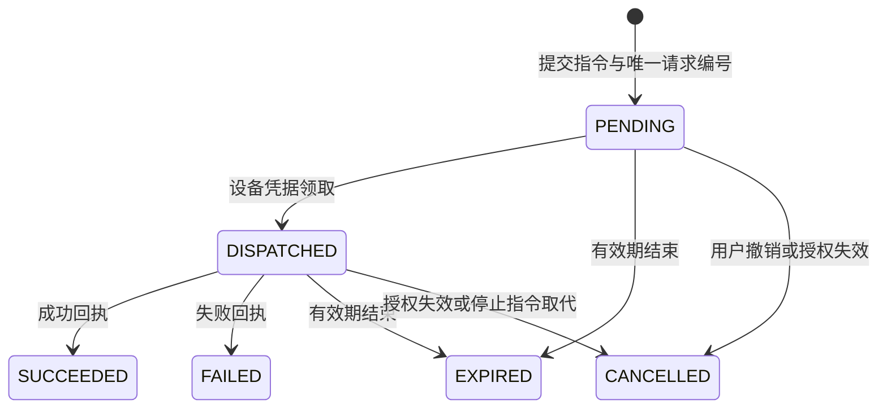

# 单农场设备校准与控制验收

本版本依据现场单农场服务的设备分类、读数语义、点位维护和指令回执方式完善多租户项目。公开仓库仅保存通用实现与重新构造的演示场景，不导入甲方数据库、设备清单、真实坐标、视频地址、供应商账号或部署配置。多租户平台尚未投入生产，已部署项目可以作为另行管理的支撑材料，其运行数据不进入本系统。

## 能力对应

| 设备 | 通用数据模型 | 本版本可验证的行为 |
| --- | --- | --- |
| 气象站 | 温湿度、风速风向、气压、光照、累计降雨 | 多指标上报、显式单位换算、历史曲线 |
| 墒情站 | 水分、温度、电导率、pH | 按设备配置有效指标，缺测保留为空，阈值告警 |
| 水情终端 | 水位、瞬时流量 | 米/毫米转换为厘米，不把空高或占位温度推断成水位 |
| 虫情终端 | 虫数、温湿度 | 整数计数与历史；无图片识别或厂商图片接入 |
| 灌溉闸门 | 实际开度、水位、远程模式、故障 | 开度目标 0–100%，指令与实际反馈分开 |
| 泵房 | 主/备泵反馈、频率、水位、电压电流、用水用电、远程模式、故障 | 主泵启动/停止、5–50 Hz 频率设置、泵房急停 |
| 视频、农机 | 在线反馈、作业速度、电量 | 设备建档、点位和状态；未接入视频流、轨迹驾驶或无人机控制 |

指标模板来自 `/api/assets/catalog` 的 `presets` 数组。模板是可编辑的通用起点，不等同于某厂家寄存器表。未安装、失效、占位节点不应上报；不同深度的同名土壤探头应分别建档，避免把多路读数混为一个指标。当前模板没有农艺标定或生产控制参数保证。

## 地图与点位

- `LOCAL_PLAN` 使用 1000 × 700 的示意坐标，随农场中心及覆盖范围映射。地块边界仍使用这套平面坐标，不代表测绘面积或土地权属。
- `WGS84` 保存独立的安装纬度、经度；调整农场中心或覆盖范围不会移动这些设备。当前 Esri / OSM 底图采用相应地理坐标，不能重复做高德偏移；GCJ-02、BD-09 数据需由接入方先转换。
- 在卫星/街道图上定位设备，保存为 WGS84；在离线图定位新的平面设备，保存为平面坐标。拖动已有 WGS84 点位时保持其坐标系。离线视图通过同一农场参考范围投影安装点位。
- 清除点位仅取消地图位置，保留设备、历史及告警。全图视野包含已定位设备。没有点位时不借用农场中心制造标记。
- 布局和设备资料均带版本号。地图位置校准会更新布局版本，旧编辑不能覆盖新坐标参考。

## 数据真实性

`lastReceivedAt` 表示服务器接收时间，`lastSampledAt` 表示最近实际采样时间。设备“正常上报”按最近采样判定，容差为预期周期的 3 倍，至少 180 秒。设备有一项新读数并不意味着所有通道都更新；每个指标另有 `freshness`，详情显示其采样时间。

历史补报正常入库，但不会把旧数据显示为实时，也不会用迟到的旧读数覆盖较新读数所形成的告警状态。零值合法；缺测、空字符串和非有限值不应替换成零。设备反馈和虫数必须是整数，二值反馈只接受 0/1。`unit` 可选，省略表示目录的标准单位；显式支持 kPa→hPa、m/mm→cm、L/min→m³/h、mS/cm→µS/cm、°C→℃，其他单位报错。未知单位不按数值大小猜测。

同一个设备的 `messageId` 防止重复入库。相同采样时刻及等价读数允许指标重排、数值小数位变化和等价单位转换；不同内容使用相同编号返回 409。

## 指令、权限与接入

管理员在设备资料勾选控制授权后，管理员和操作员可以对本租户的闸门、泵房提交指令。频率参数仅管理员可改；查看者只能读取，平台管理员只管理租户，不读取农场经营数据。控制不会扩展成员的数据范围，同租户管理员可管理多个农场。



模拟指令在一个事务内写入模拟反馈并标记成功，不发送外部消息。HTTP 设备通过领取接口获取待执行指令，服务本身没有连接生产代理、MQTT 服务或厂商云。

指令有效期 120 秒。同设备存在未完成指令时拒绝新的启动/参数指令。主泵停止或急停会使旧指令失效，再提交停止指令；已被领取的旧指令可能已执行，取消记录不等于物理停止。启动和调参要求新鲜的实际反馈、远程模式开启且无故障；停止不受数据过期限制，但仍需有效授权、启用状态及支持的接入方式。软件急停不能替代现场硬件急停。

设备端必须以指令 `id` 去重、检查 `expiresAt` 并执行自己的现场互锁。领取是至少一次投递，重复领取不会产生新编号。过期在查询/领取/回执时结算，领取查询也直接排除已到期指令。超时是“结果未知”，不能当成执行失败或成功。设备回执成功不生成传感器数值，实际开度/运行状态仍由遥测上报确认。

| 接口 | 身份 | 含义 |
| --- | --- | --- |
| `GET /api/assets/{id}/commands` | 本租户成员 | 类型支持的指令和最近 50 条记录 |
| `POST /api/assets/{id}/commands` | 管理员/操作员 | `requestId`、`action`、`value`、`note`；频率仅管理员 |
| `POST /api/assets/{id}/commands/{commandId}/cancel` | 管理员/原操作员 | 仅撤销尚未领取的指令 |
| `POST /api/ingest/commands/poll` | `X-Device-Key` | 领取该凭据所绑定设备的指令，无需请求体 |
| `POST /api/ingest/commands/{commandId}/receipt` | `X-Device-Key` | `status=SUCCEEDED/FAILED`、`note`；仅接受已领取且未过期指令 |

动作：`SET_OPENING`（整数 0–100）、`PUMP_START`、`PUMP_STOP`、`SET_FREQUENCY`（整数 5–50）、`EMERGENCY_STOP`。无参数动作的 `value` 为 null。`requestId` 在同设备内唯一，重复请求必须来自相同操作人且内容相同。回执重复内容返回 `duplicate=true`，冲突内容返回 409。

设备凭据绑定唯一设备和租户；无法在请求中切换租户。修改类型或接入协议、关闭控制、进入维护/停用、轮换凭据、停用租户时，原排队指令失效。现场网关仍需遵守有效期，因为平台无法撤回已经在外部执行的动作。

## 本机验收

1. 按 README 启动演示服务，在 `demo-a` 中打开“青禾设备联动演示场”。该场景包含三个虚构分区和九类虚构终端，重复启动不覆盖已有数据。
2. 检查地图九个标记；闸门、泵房为 WGS84，其余为示意点位。编辑/清除/恢复点位后刷新确认。
3. 打开演示闸门，先模拟采集，再提交 45% 开度。核对操作说明、模拟回执、实际开度和历史。再次采集不应随机改变已设置开度。
4. 打开泵房，模拟采集后由管理员设定 40 Hz；操作员可启动/停止，但无法修改频率；查看者没有提交入口。
5. 创建独立 HTTP 测试设备，用本机测试网关上报有效反馈并领取、回执。核对回执不会自动改写开度，以及迟到、重复、跨设备请求被正确处理。

```powershell
.\scripts\verify.ps1
# 构建本机浏览器验收所需的应用包
mvn -B -f backend/pom.xml -DskipTests package
node tools/test_farm_control.cjs
```

浏览器验收脚本启动独立的本机内存数据库与随机账号口令，结束时关闭测试服务，不使用当前运行数据库。截图位于已忽略的 `artifacts/farm-control/`。

## 历史版本与回退

改造前基线为 `before-farm-control-calibration-20261005`（PR #1 的 `4d6fb23`）。完成版本另以 `farm-control-calibration-20261005` 标记；开发分支为 `codex/farm-control-calibration`，PR 分支保留此前 UI 工作。

本次数据库结构为增量添加，不删除旧记录。**运行新版前应停止本机服务并备份业务数据库；回退旧程序时需配套恢复升级前数据库副本。** 旧版指标目录不认识新增设备数据，不能直接用旧程序打开已经写入新指标的数据库。没有需要保留的数据时，可给旧版本指定全新的测试数据库。

建议用独立目录检出基线，避免覆盖当前工作区：

```powershell
git fetch origin --tags
git worktree add ../zhinong-before-calibration before-farm-control-calibration-20261005
```

Git 标签保存源码历史，不是数据库备份。实际证明材料、授权文件、现场截图在仓库外单独保存；提交前确认不包含账号、IP、设备编号、真实坐标或个人信息。本版本没有移动或发布这些材料。
